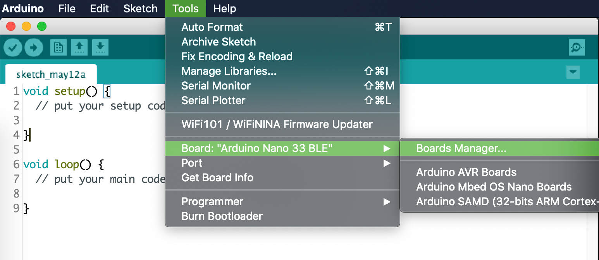
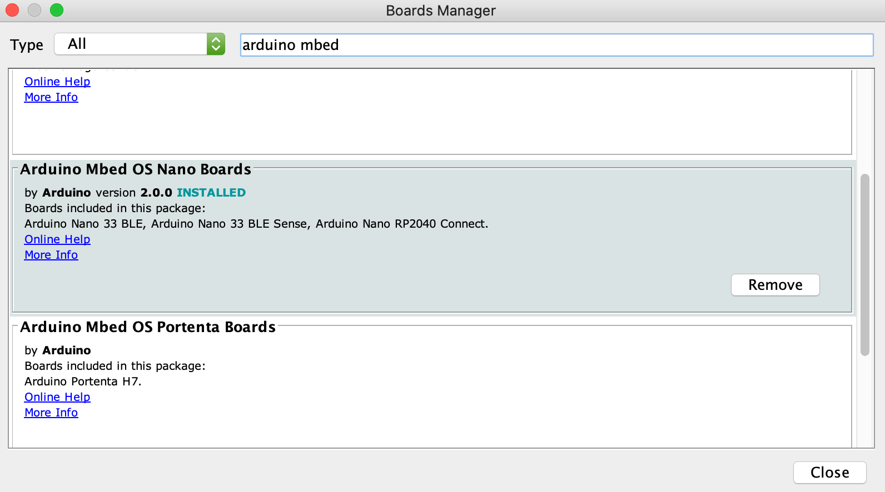
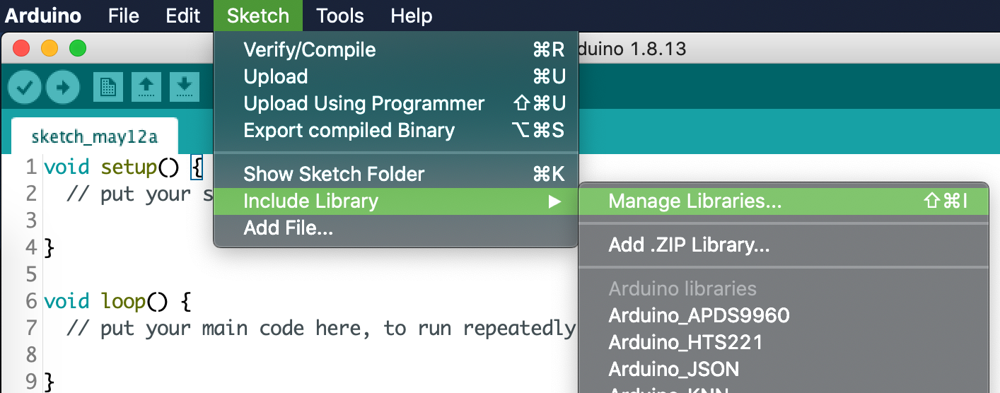

# Installation

Hi! Welcome to our installation guide, we're super glad to have you here :)

## Arduino IDE

First, download the Arduino Desktop IDE, available at https://www.arduino.cc/en/software. Select the stable release corresponding to your computer's operating system.

As of May 2021, we are using Arduino IDE 1.8.13.

## Arduino board

Now we need to install the core and necessary libraries for the Arduino Nano 33 BLE Sense. Open the Arduino IDE and navigate on the menu to:

```
Tools > Board: "<board_name>" > Boards Manager...
```



Now we will install the corresponding core for our board manager. This might take a while to install. Look for this and install it:

```
Arduino Mbed OS Nano Boards
```



As of May 2021, we are using version 2.0.0. After this installation is complete, now you can select the Arduino with this option:

```
Tools > Board: "<board_name>" > Boards Manager... > Arduino Mbed OS Nano Boards > Arduino Nano 33 BLE
```

This option is valid for both Arduino Nano 33 BLE, and for the board we are using, the Arduino Nano 33 BLE Sense.

## Arduino libraries

Next we will install all the libraries needed for this project. On the Arduino IDE, navigate on the menu to

```
Tools > Manage Libraries... >
```



Next, go to and install the custom library for this project, called `TinyTrainable`. This installation will give you the option to also install its dependencies, select `Install all` to additionally download these libraries:

* Libraries for using the embedded sensors of our microcontroller:
    * `Arduino_APDS9960`: color, proximity
    * `Arduino_LSM9DS1` acceleration, magnetic field, gyroscope orientation
* Libraries for machine learning:
    * `Arduino_KNN`: k-nearest neighbor algorithm.
    * `Arduino_TensorFlowLite`: microcontroller version of the TensorFlow machine learning library. Please download the latest non-precompiled version.

To test if all dependencies were installed successfully, plug in your Arduino, navigate to `File > Examples > TinyTrainable > hello_none`, then press the upload button to send the code to the Arduino (Note that this is the procedure for running all examples). After it's done compiling, you should see it light up and cycle between its LEDs.

If you still have questions about setting up the microcontroller, the full startup guide is available [here](https://www.arduino.cc/en/Guide/NANO33BLESense).

## Python, Jupyter, TensorFlow

For input-color, you only need Arduino libraries. For input-gesture and input-speech, you also need to have Python, in order to train with TensorFlow and Jupyter on your computer.

Your computer might have Python already installed, and it might be one that is not compatible with the TensorFlow version we are using.

These are the versions we will be using, as of January 2021:

* Python 3.8.6
* TensorFlow 2.3.2
* Jupyter Lab 3.0.5

In order to be able to manage different versions of Python, we suggest installing the tool pyenv https://github.com/pyenv/pyenv.

After installing pyenv, on the terminal go to this repository

```bash
cd tiny-trainable-instruments/
```

Check that pyenv is able to read the .python-version file

```bash
pyenv versions
```

You should see a list, with the version we are using and an asterisk, to highlight that this is the Python version we will use. If there is no asterisk and it says that the required version of python is not installed, use the command

```bash
pyenv install <python version number>
```

If you are using an old version of pyenv, there's a chance that the install won't work; copy the entire command pyenv gives you (including the &&'s) and enter it into the terminal. Then once pyenv is updated, try the above command again.

Now that you have the correct version of Python, create a virtual environment (which we will name env) using the Python package venv. Most dependency problems can be solved by using a virtualenv; we can’t support issues not using a virtualenv due to the huge variety of system configurations.

```bash
python -m venv env
```

Activate the virtual environment with this command, which you will use every time you want to enter the venv:

```bash
source env/bin/activate
```

Now your terminal should have every new line starting with (env). Your command prompt should look something like this:


The pip of your Python virtual environment might need updating; you can update to the latest version with the command

```bash
pip install --upgrade pip
```

Then use pip to install the Jupyter packages, along with their dependencies:

```bash
pip install -r requirements.txt
```

Now you can run the Jupyter Lab tool with `jupyter-lab`. This will open a tab on your browser to navigate through the files in your computer and allow you run code and read the documentation.

The code for input-gesture and input-speech is written using Jupyter notebooks, which have the extension .ipynb, and are located on the folder instruments/.

The documentation is written in several Markdown files with extension .md. These files are on the folder docs/, which includes an index on README.md.

If you double click on a Markdown file, it will open an Editor window with the Markdown code. To view the rendered text you can right click and select "Open with Markdown Preview".

If you have internet connection, it might be more convenient to access the online documentation on the online repository.

To close the Jupyter notebook server, press `ctrl+c` in the terminal (even on OSX; it's not `cmd`) and confirm with `y`.

To exit the virtual environment once you're done, use the command `deactivate`. Note that the command `jupyter-lab` will not work until you reactive the virtual environment.
